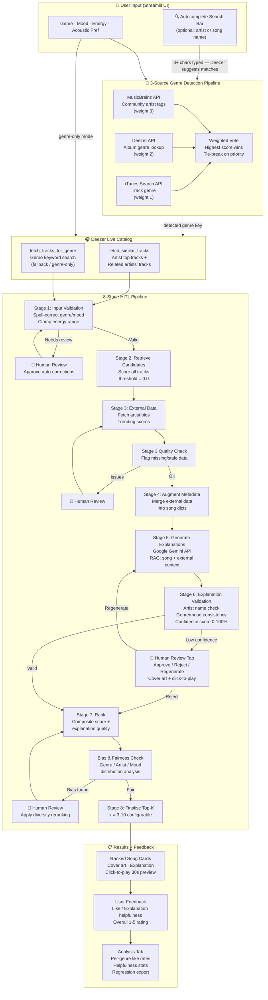

## Applied AI System

## Original Project

The original project was the ai110-module3show-musicrecommendersimulation-starter.
The original purpose of this project was to build a trained music recommender model that could represent songs and a user "taste profile" as data and, using a scoring rule, turns that data into recommendations. The system recommends based on genre, mood, energy, tempo. The user profile consist of the preferences of genre, mood, energy, and if they like acoustics or not. The recommender should prefer genres and score it higher than other aspects. If the recommender finds a match for between a songs values and user preferences it favors those songs. If a song has a similar genre preference to a user it will be preferred rather than songs that matches a users mood and energy but doesn't match genres.

## MusicMatcher+

## Title and Summary
My project is called MusicMatcher+. It is an extension of the music recommender project we had worked on previously. It is a human in the loop recommender system that takes user preferences as an input and outputs recommendations based on how closely they match the users preferences. It then uses gemini's API to generate a explanation of the recommendation. It then allows users to validate the recommendation and leave feedback to help improve the recommender.

## Architecture Overview

The pipeline starts with the Streamlit UI. If the user types an artist or song into the autocomplete search bar, the **3-source genre detection pipeline** (MusicBrainz → Deezer → iTunes, weighted voting) identifies the correct genre. The **Deezer Live Catalog** then fetches real tracks — either similar artists and related tracks when a search query is given, or a genre keyword search when using preferences alone. The 8-stage HITL pipeline then validates input, retrieves and scores candidates, fetches external artist data, augments metadata, generates Gemini explanations (RAG: LLM reads real song and artist context), validates those explanations for hallucinations and factual accuracy, ranks by composite score, checks for bias, and finalises the top-k results. Users review song cards with click-to-play cover art previews, can approve/reject/regenerate each explanation, and leave per-song feedback that feeds into the analysis tab.

## Set up instructions

Run:

python -m venv .venv

Install required packages:

pip install -r requirements.txt

Create a .env file in the project root.

Add:

GEMINI_API_KEY=your_api_key_here

streamlit run app.py

## Design Decisions

I designed the the recommender to be more a human in the loop system rather than an automated ranker. The recommendation model by default prioritizes genre because I believe genre matches are more important than matching mood or energy. Originally there were more steps in the pipeline but some of the steps seemed redundant. For example originally there was a section the just retrieved the data and then you would have to go to a separate tab to get the explanation. That seemed pointless to me so I wrapped both features into one. I added a search bar as well to help people better match their music tastes. At the end it gives you the top K recommendations based on user preferences, so if it finds 15 songs that matches the users tastes it returns the top K results where k can equal a number between 3-10.

## Testing Summary
It took a lot of hardwork to get this to work as expected. Intially the project started off as a simple extension of the music recommendation project just adding the pipeline and a working UI. After that I wanted to extend it so that it worked with real music. To do so I told the AI agent to incorporate both Deezer's and Itunes API's, Deezer to grab the songs metadata and Itunes for better genre analysis. This, however, was not effective. The agent used Itunes to search for music and Itunes catalog was not extensive so when searching for certain artist/songs nothing would come up. To fix this issue I prompted the agent to use Deezer to search for songs and Itunes to match with genre's. This fixed the initial issue of not being able to find songs but the genre matching system was broken. It would match songs that were Alternative Hiphop to Alternative rock because of the use of the tag Alternative. To fix this I implemented a 3 stage pipeline utilizing deezer, musicbrain, and Itunes. The pipeline uses all APIs to score the a songs genre this helped fix issues with genre matching.The last issue remaining was the fact that recommendations were too general. If the song was hiphop it would try to recommend generic hiphop songs, to fix this I prompted the agent to make more specific recommendations that matched the artisst, song, and niche. 

## Reflection 
I learned from this experience how to write plans as prompts to get specific results from the agent. When I was too general it would do things that it thought I wanted rather than what I actually needed to be done. AI is an incredible tool but at the end of the day that is all it is. It is a tool that you need to know how to properly utilize or else you will be stuck constantly reprompting to try to get the results you want. I learned that adding context such as pictures help the agent solve the problem by a great deal and that text prompting is not enough all of the time. I also learned that by having a better understanding of what APIs you want to use and their capabilities you can better guide the agent to building the application you're trying to create.

## Sample input

## Sample output

## Guardrails Example

## Walkthrough
https://drive.google.com/file/d/1psdfuiNlcfqt2Jn6enla5IDkVtyAYPML/view?usp=sharing